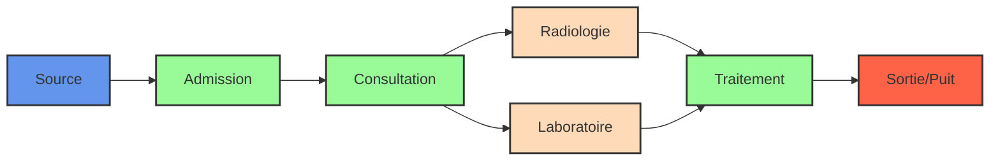

# 🏥 Optimisation des Flux de Patients dans un Hôpital
### *Application de la Recherche Opérationnelle et de l'Algorithme de Flot Maximal*


---

## 📋 Table des Matières

- [🔍 Contexte](#-contexte)
- [🎯 Objectifs](#-objectifs)
- [🔄 Modélisation du Projet](#-modélisation-du-projet)
- [⚙️ Installation](#️-installation)
- [🚀 Exécution du Projet](#-exécution-du-projet)
- [📂 Structure du Projet](#-structure-du-projet)
- [📊 Résultats](#-résultats)
- [🙏 Remerciements](#-remerciements)
- [👥 Auteurs](#-auteurs)

---

## 🔍 Contexte

Dans de nombreux établissements hospitaliers, **des problèmes récurrents** apparaissent en raison de :

- ⏱️ Temps d'attente excessifs pour les patients
- 👨‍⚕️ Surcharge du personnel médical
- 🏢 Gestion inefficace des flux de patients
- 📉 Ressources limitées (médecins, salles, équipements)

Ce projet applique des **techniques avancées de recherche opérationnelle**, en particulier l'algorithme de flot maximal, pour optimiser le parcours des patients et résoudre ces problématiques critiques.

---

## 🎯 Objectifs

<div align="center">
  
| Objectif | Description |
|:-------:|:------------|
| 📈 | **Maximiser** le nombre de patients traités par heure |
| ⌛ | **Réduire** les temps d'attente à chaque étape du parcours |
| 🔧 | **Améliorer** l'utilisation des ressources (humaines et matérielles) |
| 📊 | **Identifier** les goulets d'étranglement dans le système hospitalier |
| 💡 | **Proposer** des solutions d'optimisation basées sur des données concrètes |

</div>

---

## 🔄 Modélisation du Projet

Le parcours patient est modélisé sous forme de **graphe orienté** où :



- **Nœuds** : Représentent les différentes étapes du parcours patient (Admission, Consultation, Radiologie, etc.)
- **Arcs** : Connectent ces étapes et indiquent, via leurs capacités, le nombre maximal de patients pouvant transiter d'une étape à l'autre par heure
- **Algorithme de flot maximal** : Détermine le flux optimal de patients à travers l'ensemble du système hospitalier, en respectant toutes les contraintes de capacité

---

## ⚙️ Installation

### Prérequis

- **Python 3.x**
- **Bibliothèques Python requises** :

<div align="center">
  
| Bibliothèque | Fonction |
|--------------|----------|
| **Streamlit** | Création de l'interface graphique interactive |
| **NetworkX** | Modélisation du graphe et implémentation de l'algorithme |
| **Matplotlib** | Visualisation des graphes et des résultats |
| **Graphviz** (optionnel) | Génération de schémas explicatifs |

</div>

### Installation des Dépendances

```bash
# Installation des bibliothèques nécessaires
pip install streamlit networkx matplotlib graphviz

# Vérification de l'installation (optionnel)
pip list | grep -E "streamlit|networkx|matplotlib|graphviz"
```

> ⚠️ **Note**: Assurez-vous que Graphviz est correctement installé et configuré sur votre machine pour les fonctionnalités de visualisation avancées.

---

## 🚀 Exécution du Projet

1. **Téléchargement**
   ```bash
   git clone https://github.com/elabdioui/index.py.git
   cd hospital-flow-optimization
   ```

2. **Lancement de l'application**
   ```bash
   streamlit run index.py
   ```

3. **Navigation dans l'application**

<div align="center">
  
| Étape | Description |
|-------|-------------|
| **Introduction** | Présentation du contexte et de la problématique |
| **Création du graphe** | Visualisation du parcours patient avec ses capacités |
| **Schéma explicatif** | Illustration détaillée du parcours du patient |
| **Calcul du flot maximal** | Application de l'algorithme pour déterminer le flux optimal |
| **Analyse des résultats** | Identification des goulets d'étranglement et propositions d'améliorations |

</div>

---

## 📂 Structure du Projet

```
project-directory/
│
├── main.py                        # Script principal de l'application
├── schema_parcours_patient.png    # Image illustrant le parcours patient
├── README.md                      # Documentation du projet
└── requirements.txt               # Liste des dépendances Python
```

---

## 📊 Résultats

L'application permet de :

- **📈 Calculer le flot maximal** : Nombre optimal de patients pouvant être traités par heure
- **🔍 Identifier les goulets d'étranglement** : Points critiques comme la Radiologie et le Traitement Radiologique
- **💡 Proposer des améliorations** :
  - Ajustement des ressources matérielles et humaines
  - Réorganisation du parcours patient
  - Planification optimisée des rendez-vous
  - Redimensionnement des services critiques

---

## 🙏 Remerciements

<div align="center">
  
Nous exprimons notre profonde gratitude à 

**Mme Zineb Tabbakh**

*Professeur de Recherche Opérationnelle*

Pour son soutien précieux et ses conseils avisés tout au long de ce projet.

</div>

---

## 👥 Auteurs

<div align="center">
  
| Auteur | Contact |
|--------|---------|
| **Haitham El Abdioui** | [elabdiouihaitham@gmail.com](mailto:elabdiouihaitham@gmail.com) |

</div>

---

<div align="center">
  
**© 2025 - Projet d'Optimisation des Flux Hospitaliers**  
*Tous droits réservés*

</div>
